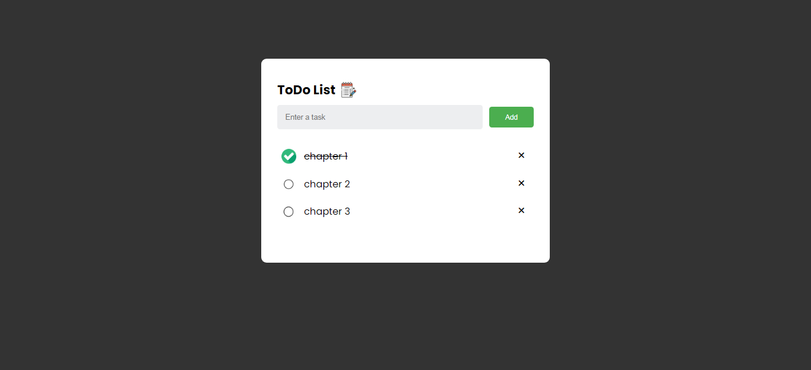

# ✅ To-Do List App

A simple and interactive To-Do List web application built with **HTML**, **CSS**, and **JavaScript**.  
It allows users to add, complete, and delete tasks, with data persistence using **Local Storage**.



---

## 🚀 Features

- ➕ Add new tasks
- ✅ Mark tasks as completed (toggle `checked` class)
- ❌ Delete tasks using the **X** icon
- 💾 Automatically saves tasks to **Local Storage**
- 🔄 Load saved tasks when the page is refreshed
- ⌨️ Add tasks by pressing the **Enter** key
- 🎯 Clean and responsive user interface

---

## 🛠️ Technologies Used

- HTML5
- CSS3
- JavaScript (ES6)
- Local Storage API

---

## 📁 Project Structure

```
📂 To-Do-List/
├── 📄 index.html        # Main HTML structure
├── 📄 style.css         # Styling and layout
├── 📄 script.js         # Application logic (CRUD + Local Storage)
└── 📄 README.md         # Project documentation
```

---

## 🧠 How It Works

1. Write a task in the input field.  
2. Click the **Add** button or press **Enter** to add it.  
3. Click on a task text to toggle its completion status.  
4. Click the **X** icon to delete a task.  
5. All tasks are automatically saved in your browser's Local Storage.

---

## 🔧 How to Run Locally

1. Clone the repository:
   ```bash
   git clone https://github.com/KarimFawzy01/todo-list.git
   ```
2. Open `index.html` in your browser.
3. Start managing your tasks!

---

## 📌 Future Improvements

- Edit existing tasks
- Drag and drop to reorder tasks
- Add due dates or priority levels

---

## 🙌🏻 Acknowledgements
Inspired by various JavaScript tutorials and personal practice.

---

## 📄 License
This project is open source and available under the MIT License.